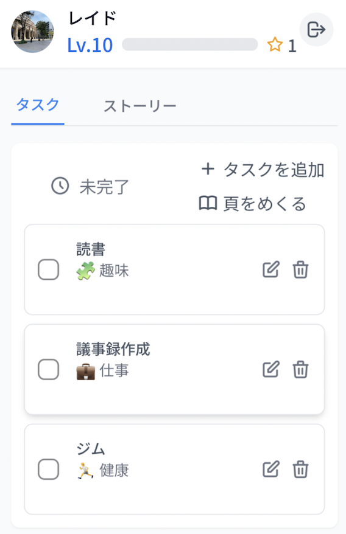

# ToDo Chronicle

日々のタスク管理を"異世界ファンタジー物語"に変える、生成AI活用タスク管理アプリ。

## 🎯 主な機能
- タスクの管理を行う。
- 完了したタスクの内容に応じて物語を自動生成する。（生成AI活用）
- ゲーミフィケーション（経験値・レベルアップ）
- 物語のシーズン最終章で完了タスクの内容をもとに行動傾向を分析し、その結果を生成AIで出力する。（生成AI活用）
- 物語のシーズン最終章でイラストを自動生成する。（生成AI活用）

## 🖼️ スクリーンショット
- デスクトップ版

- モバイル版

## 💡 技術スタック
- フロントエンド: Angular 18, Firebase Hosting, TailwindCSS
- バックエンド: FastAPI, Cloud Run, Firestore, Firebase Authentication
- AI: Vertex AI (Gemini 2.0 Flash), Replicate (google-imagen3)

## 📊 システム構成図

## 📝 ライセンス
MIT License